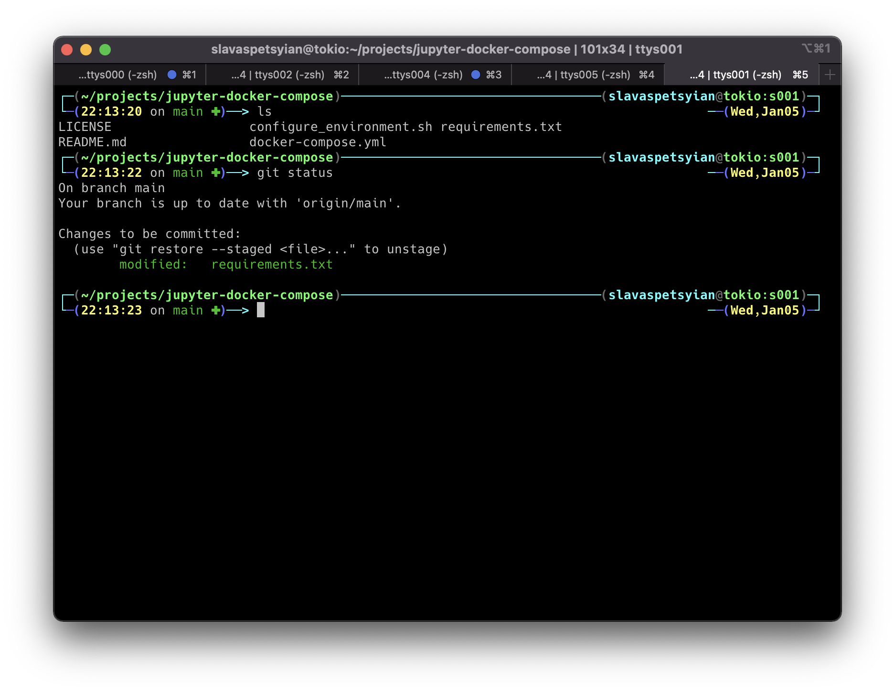

# Mac-conf

MacOS Terminal Configuration for Developers

## What it makes

* [Oh My Zsh](https://github.com/ohmyzsh/ohmyzsh) with `Jonathan` theme (example in screenshots)
* [NvChad edition](https://nvchad.github.io/) NeoVim configuration 

## Dependencies

* [XCode](https://developer.apple.com/download/all/) 
* [iTerm2](https://iterm2.com/) 
* [Oh My Zsh](https://github.com/ohmyzsh/ohmyzsh) 

## Setting up configuration

1. Install [iTerm2](https://iterm2.com/) if not yet installed
   
2. Install [Oh My Zsh](https://github.com/ohmyzsh/ohmyzsh) if not yet installed

3. Copy files to `$HOME` (`~`) folder

~~~ bash
$ cd ~
$ git clone https://github.com/saequus/mac-conf.git
$ cd mac-conf
$ cp -rf mac-conf ~/
$ make prepare
~~~

4. Reload terminal
   
5. To enable nerd fonts with icons for NeoVim go to 
   * iTerm2 -> 
   * Profiles -> 
   * Default (or any other Profile you use) -> 
   * Mark checkbox `User a different font for non-ASCII text`
   * Don't forget to download and set one of [Nerd Fonts](https://www.nerdfonts.com/) at the Font field at this tab
  
6. Remove repo from your machine
 

