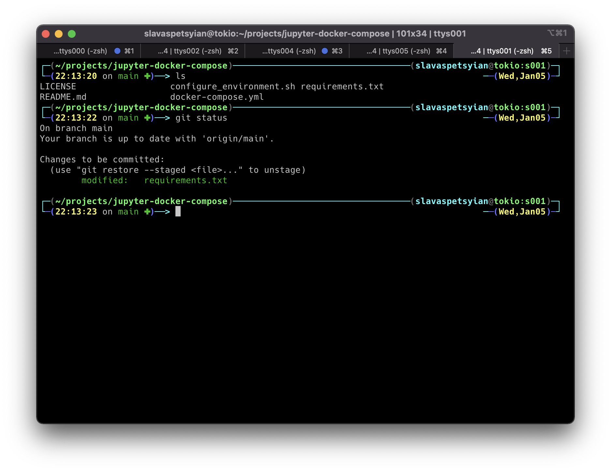
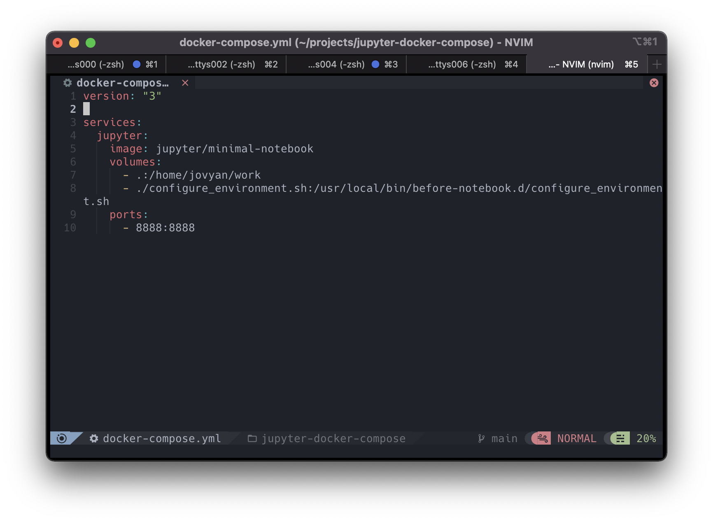

# Mac-conf

MacOS Terminal Configuration for Developers

## Examples

Zsh with Jonathan Theme

NeoVim with NvChad

## What is it for

* Simplify terminal usage with `iterm2` as main terminal
* Set up your terminal with [Oh My Zsh](https://github.com/ohmyzsh/ohmyzsh) `Jonathan` theme (screenshots in examples)
* Configure NeoVim with NvChad (screenshots in examples)
* Add `.github` hooks to use one GitHub account per repository (need to switch manually)  

## Dependencies

* [XCode](https://developer.apple.com/download/all/) 
* [iTerm2](https://iterm2.com/) 
* [Oh My Zsh](https://github.com/ohmyzsh/ohmyzsh) 
* [NvChad](https://nvchad.com/) 

## Setting up configuration

1. Install [iTerm2](https://iterm2.com/)
   
2. Install [Oh My Zsh](https://github.com/ohmyzsh/ohmyzsh)

3. Change `{USER}` in `.zshrc` to your name (`whoami`) 

4. Copy files to `$HOME` (`~`) folder

~~~ bash
$ cd ~
$ git clone https://github.com/saequus/mac-conf.git
$ cd mac-conf
$ make prepare
~~~

4. Reload terminal
~~~ bash
$ source ~/.zshrc
# now new styles should be applied to the shell 
~~~
   
5. To enable nerd fonts with icons for NeoVim go to 
   * iTerm2 -> 
   * Profiles -> 
   * Default (or any other Profile you use) -> 
   * Mark checkbox `User a different font for non-ASCII text`
   * Don't forget to download and set one of [Nerd Fonts](https://www.nerdfonts.com/) at the Font field at this tab
  
6. Remove repo from your machine
 

